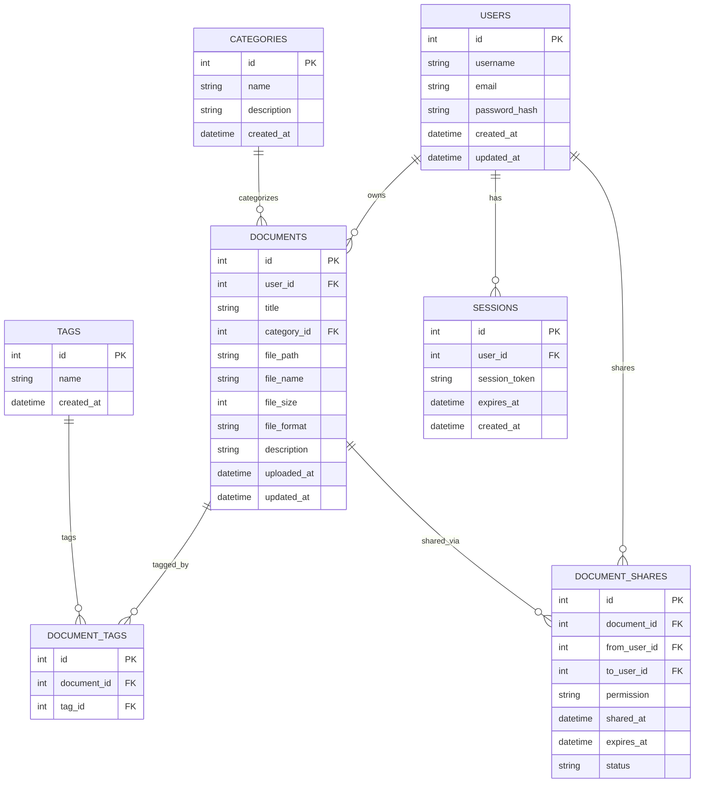
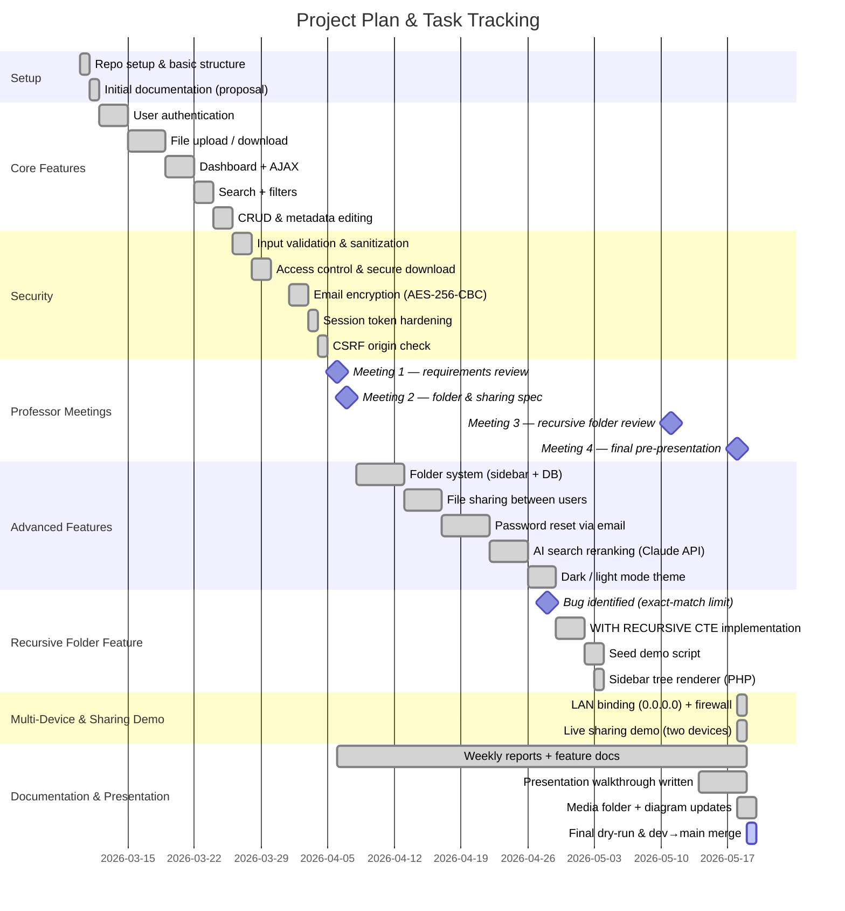

# Diagrams


## System Diagrams

### 1. High-Level Architecture (Mermaid)

```mermaid
flowchart LR
    Browser[User Browser]
    Server[Web Server (PHP)]
    DB[SQLite Database]
    Uploads[Uploads Directory]

    Browser -- HTTP(S) --> Server
    Server -- SQL --> DB
    Server -- Read/Write --> Uploads

    subgraph App
        Server
        DB
        Uploads
    end
```

##3 2. Database Schema (Mermaid ERD)



> **Note:** This design follows 3rd normal form (3NF) by keeping entities separated (users, documents, tags, categories) and using junction tables for many-to-many relationships.

## Group Work Management (MBI MENAXHIMIN E PUNES NE GRUP)

### 1. Tools for collaboration and code management
- **Version control & code collaboration:** Git + GitHub (or GitLab/Bitbucket)
- **Task tracking:** GitHub Issues / Projects, Trello, or similar Kanban boards
- **Communication:** Slack / Microsoft Teams / Discord / Email
- **Documentation:** Markdown files in `.docs/` + README

### 2. Project planning & tracking (Kryetari i grupit)
Kryetari i grupit (Project Lead) krijon një **plan projekti** dhe monitoron ecurinë duke përdorur një **Gantt chart** për detyrat e përditësuara.

#### Gantt Chart (Mermaid)


### 3. Weekly report (Personi i kontaktit)
Personi i kontaktit duhet të përgatisë **raport javor** mbi mbledhjet, diskutimet dhe vendimet e marra brenda grupit (shiko `report.md`).
