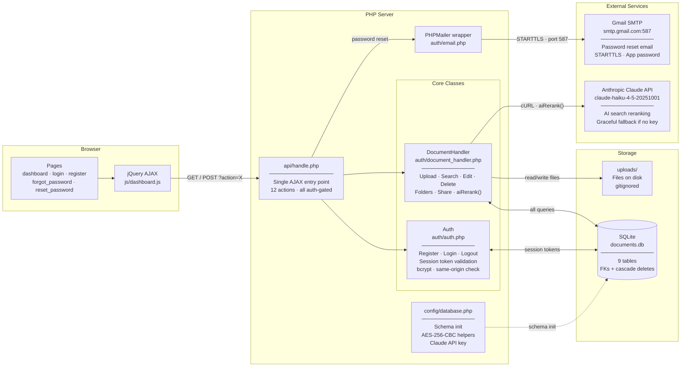
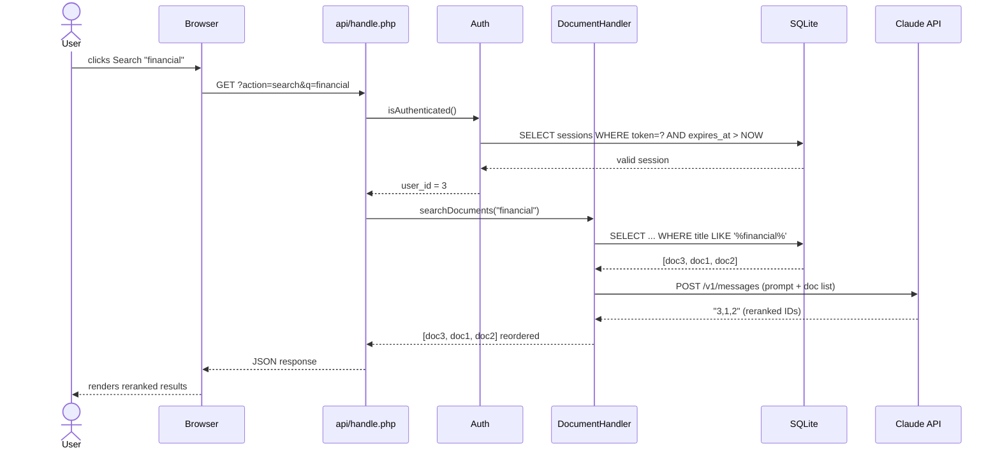
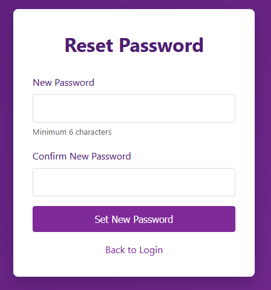
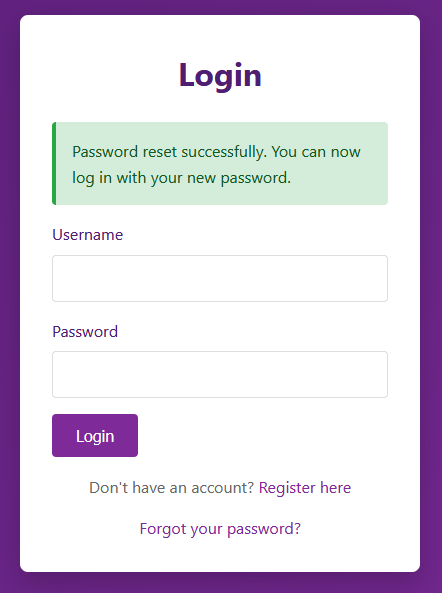
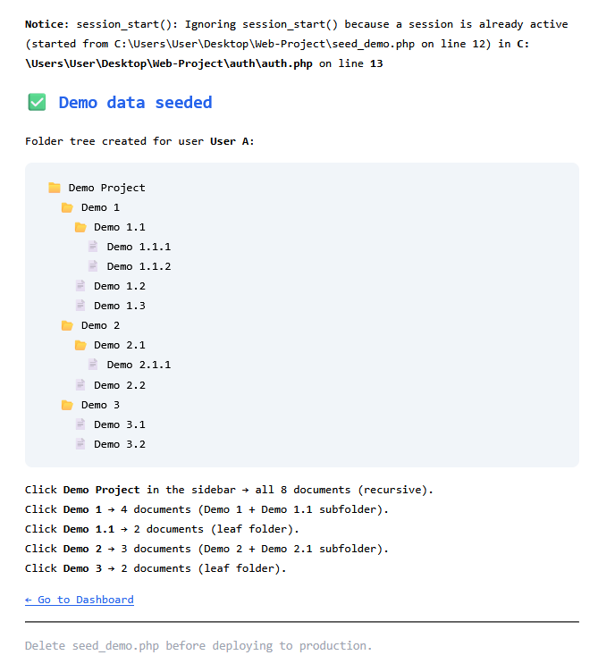

# Document Management System — Web Dev Class

## Installation & Start-up

Refer to: _installation.md

---

## Feature checklist

- [x] Authentication
    - [x] Register / Login / Logout  `auth/auth.php`
    - [x] Session tokens (stored in DB, 24h expiry)  `sessions` table
- [x] Secure file upload  `auth/document_handler.php`, `api/handle.php`
    - [x] Categories & Tags
    - [x] List, Filter, Delete files
- [x] Dashboard + AJAX  `dashboard.php`, `js/dashboard.js`
- [x] Secure file download  `download.php`  (auth-gated, no raw path exposed)
- [x] Edit document metadata inline  (modal in dashboard)
- [x] Folder system with file icons  `folders` table, sidebar in dashboard
- [x] File sharing between users  `shares` table
- [x] Claude API integration for AI-ranked search  `auth/document_handler.php → aiRerank()`
- [x] Password reset via email  `forgot_password.php`, `reset_password.php`, PHPMailer

---

## Explanation of Basic Notions Used

**API**
A contract between two programs: one exposes URLs (endpoints) that accept requests in a defined format and return structured responses (usually JSON). This project uses APIs in two directions:
- *Inward*: the browser calls our own `api/handle.php` via AJAX
- *Outward*: our PHP calls the Claude API and Gmail SMTP

**SESSION**
PHP's `$_SESSION` is just a server-side key-value store keyed to a cookie in the browser. We extend it with a DB-backed token: on login a `bin2hex(random_bytes(32))` token is written to the `sessions` table and also put in `$_SESSION['token']`. On every request `Auth::isAuthenticated()` checks that the token exists in the DB and hasn't expired.

**HANDLER**
A class that owns all the logic for one domain. `Auth` handles users and sessions. `DocumentHandler` handles everything about files — upload, list, search, edit, share, folders. `api/handle.php` is the HTTP-level handler: a single entry point that reads `?action=X` and routes to the right method.

**cURL**
PHP's library for making outbound HTTP requests. We use it in `aiRerank()` to call the Anthropic API endpoint. `curl_init()` → `curl_setopt()` (headers, body, method) → `curl_exec()` → `curl_close()`.

**GET / POST**
- `GET`: reads data, params in the URL (`?search=invoices`). Used for: list documents, get folders, search.
- `POST`: sends data in the request body (not the URL). Used for: upload, login, delete, edit, share. Anything that mutates state must be POST.

---


## Code Overview

### Stack

* PHP 7.4+ (built-in server: `php -S localhost:8000`)
* SQLite 3 via PDO (`pdo_sqlite`, `sqlite3` extensions)
* jQuery (local copy at `js/jquery.min.js` — CDN unreachable on local network)
* PHPMailer (`lib/PHPMailer/`) for Gmail SMTP
* Anthropic Claude API (`claude-haiku-4-5-20251001`) for AI search reranking


## File Structure

```
Web-Project/
│
├── index.php                  → redirects to login or dashboard
├── login.php                  → login form + "Forgot password?" link
├── register.php               → registration form
├── logout.php                 → destroys session, redirects
├── dashboard.php              → main app view (table, sidebar, modals)
├── download.php               → auth-gated file download handler
├── forgot_password.php        → email input form → generates reset token
├── reset_password.php         → validates token → change password form
├── edit_document.php          → (legacy standalone page, superseded by modal)
│
├── api/
│   └── handle.php             → single AJAX entry point, routes by ?action=
│
├── auth/
│   ├── auth.php               → Auth class: register, login, logout, session check
│   ├── document_handler.php   → DocumentHandler class: all file + folder + share logic
│   └── email.php              → sendEmail() wrapper using PHPMailer
│
├── config/
│   ├── database.php           → PDO connection, schema init, encryption helpers
│   └── mail.php               → Gmail SMTP credentials (gitignored)
│
├── lib/
│   └── PHPMailer/             → PHPMailer.php, SMTP.php, Exception.php
│
├── js/
│   ├── jquery.min.js          → local jQuery copy
│   └── dashboard.js           → all AJAX calls, modal handlers, table rendering
│
├── css/
│   └── style.css              → layout, modals, tab bar, folder tree, icons
│
├── data/                      → gitignored
│   ├── documents.db           → SQLite database file
│   └── mail.log               → PHPMailer error log
│
├── uploads/                   → gitignored — actual uploaded files
│
├── .htaccess                  → blocks direct browser access to auth/, config/, data/, uploads/
├── .gitignore
└── .docs/                     → all project documentation
```


### Database


```sql
-- Users: stores credentials + encrypted email
CREATE TABLE IF NOT EXISTS users (
  id          INTEGER PRIMARY KEY AUTOINCREMENT,
  username    TEXT UNIQUE NOT NULL,
  email       TEXT NOT NULL,          -- AES-256-CBC encrypted, base64-encoded
  email_hash  TEXT UNIQUE NOT NULL,   -- SHA-256 of lowercase email, used for lookups
  password    TEXT NOT NULL,          -- bcrypt via password_hash()
  created_at  DATETIME DEFAULT CURRENT_TIMESTAMP,
  updated_at  DATETIME DEFAULT CURRENT_TIMESTAMP
);

-- Sessions: DB-backed tokens (more secure than PHP session alone)
CREATE TABLE IF NOT EXISTS sessions (
  id            INTEGER PRIMARY KEY AUTOINCREMENT,
  user_id       INTEGER NOT NULL,
  session_token TEXT UNIQUE NOT NULL, -- bin2hex(random_bytes(32))
  expires_at    DATETIME NOT NULL,    -- 24 hours from creation
  created_at    DATETIME DEFAULT CURRENT_TIMESTAMP,
  FOREIGN KEY (user_id) REFERENCES users(id) ON DELETE CASCADE
);

-- Categories: Tickets, Contracts, Reports, Other (seeded)
CREATE TABLE IF NOT EXISTS categories (
  id          INTEGER PRIMARY KEY AUTOINCREMENT,
  name        TEXT UNIQUE NOT NULL,
  description TEXT,
  created_at  DATETIME DEFAULT CURRENT_TIMESTAMP
);

-- Documents: one row per uploaded file
CREATE TABLE IF NOT EXISTS documents (
  id          INTEGER PRIMARY KEY AUTOINCREMENT,
  user_id     INTEGER NOT NULL,
  title       TEXT NOT NULL,
  category_id INTEGER,
  file_path   TEXT NOT NULL,          -- server path (never exposed to client)
  file_name   TEXT NOT NULL,          -- original filename
  file_size   INTEGER NOT NULL,       -- bytes
  file_format TEXT NOT NULL,          -- extension (pdf, docx, jpg…)
  description TEXT,
  folder_id   INTEGER DEFAULT NULL,   -- FK to folders (added via ALTER TABLE)
  uploaded_at DATETIME DEFAULT CURRENT_TIMESTAMP,
  updated_at  DATETIME DEFAULT CURRENT_TIMESTAMP,
  FOREIGN KEY (user_id) REFERENCES users(id) ON DELETE CASCADE,
  FOREIGN KEY (category_id) REFERENCES categories(id) ON DELETE SET NULL
);

-- Tags: free-form labels
CREATE TABLE IF NOT EXISTS tags (
  id         INTEGER PRIMARY KEY AUTOINCREMENT,
  name       TEXT UNIQUE NOT NULL,
  created_at DATETIME DEFAULT CURRENT_TIMESTAMP
);

-- document_tags: many-to-many join
CREATE TABLE IF NOT EXISTS document_tags (
  id          INTEGER PRIMARY KEY AUTOINCREMENT,
  document_id INTEGER NOT NULL,
  tag_id      INTEGER NOT NULL,
  UNIQUE(document_id, tag_id),
  FOREIGN KEY (document_id) REFERENCES documents(id) ON DELETE CASCADE,
  FOREIGN KEY (tag_id)      REFERENCES tags(id)      ON DELETE CASCADE
);

-- Folders: supports nesting via parent_id (NULL = root)
CREATE TABLE IF NOT EXISTS folders (
  id         INTEGER PRIMARY KEY AUTOINCREMENT,
  name       TEXT NOT NULL,
  user_id    INTEGER NOT NULL,
  parent_id  INTEGER DEFAULT NULL,
  created_at DATETIME DEFAULT CURRENT_TIMESTAMP,
  FOREIGN KEY (user_id)   REFERENCES users(id)   ON DELETE CASCADE,
  FOREIGN KEY (parent_id) REFERENCES folders(id) ON DELETE SET NULL
);

-- Shares: document_id + shared_with_user_id must be unique (no duplicate shares)
CREATE TABLE IF NOT EXISTS shares (
  id                   INTEGER PRIMARY KEY AUTOINCREMENT,
  document_id          INTEGER NOT NULL,
  owner_id             INTEGER NOT NULL,
  shared_with_user_id  INTEGER NOT NULL,
  permission           TEXT DEFAULT 'read',
  created_at           DATETIME DEFAULT CURRENT_TIMESTAMP,
  UNIQUE(document_id, shared_with_user_id),
  FOREIGN KEY (document_id)         REFERENCES documents(id) ON DELETE CASCADE,
  FOREIGN KEY (owner_id)            REFERENCES users(id)     ON DELETE CASCADE,
  FOREIGN KEY (shared_with_user_id) REFERENCES users(id)     ON DELETE CASCADE
);

-- Password resets: single-use tokens with 1h expiry
CREATE TABLE IF NOT EXISTS password_resets (
  id         INTEGER PRIMARY KEY AUTOINCREMENT,
  user_id    INTEGER NOT NULL,
  email_hash TEXT NOT NULL,           -- SHA-256, used to look up user
  token      TEXT UNIQUE NOT NULL,    -- bin2hex(random_bytes(32))
  expires_at DATETIME NOT NULL,       -- NOW + 1 hour
  used       INTEGER DEFAULT 0,       -- 1 after redemption
  created_at DATETIME DEFAULT CURRENT_TIMESTAMP,
  FOREIGN KEY (user_id) REFERENCES users(id) ON DELETE CASCADE
);
```

### Email Encryption

Emails are stored encrypted (AES-256-CBC) so the DB file doesn't leak addresses. Lookups use a SHA-256 hash instead of the plaintext.

```php
// config/database.php
define('ENCRYPTION_KEY', getenv('ENCRYPTION_KEY') ?: 'change_me_to_a_random_secret');
define('ENCRYPTION_METHOD', 'AES-256-CBC');

// Encrypt before INSERT
$encryptedEmail = encryptValue($email);  // → base64(IV + ciphertext)
$emailHash      = hash('sha256', strtolower(trim($email)));

// Lookup without decrypting
SELECT * FROM users WHERE email_hash = :hash

// Decrypt when displaying
$plainEmail = decryptValue($row['email']);
```

`decryptValue()` uses `base64_decode($value, true)` (strict mode) — if the stored value is not valid base64 (e.g. plain-text email from before openssl was enabled), it returns the raw value instead of crashing.

---

### API Endpoints — `api/handle.php`

All calls go to a single file. `?action=X` routes to the right logic. All require an active session (401 if not).

| Action | Method | What it does |
|--------|--------|-------------|
| `upload` | POST | Validate + store file, save metadata to DB |
| `get_documents` | GET | Return all documents for current user (with filters) |
| `search` | GET | Keyword search + AI reranking via Claude |
| `delete` | POST | Delete file and DB record (ownership check) |
| `get_tags` | GET | Return all tags |
| `get_categories` | GET | Return all categories |
| `edit_document` | POST | Update title, category, tags, description |
| `create_folder` | POST | Insert new folder for current user |
| `get_folders` | GET | Return all folders for current user |
| `get_folder_documents` | GET | Return documents inside a specific folder |
| `share_document` | POST | Share a document with another user by username |
| `get_shared_documents` | GET | Return documents shared with current user |

---

### DocumentHandler Methods — `auth/document_handler.php`

| Method | Description |
|--------|-------------|
| `uploadFile($title, $category_id, $tags, $file, $folder_id)` | Validate, move file, INSERT document + tags |
| `getDocuments($filters)` | SELECT with optional category/tag/search filters |
| `searchDocuments($query)` | SQL LIKE search → passes results to `aiRerank()` |
| `deleteDocument($id)` | Ownership check → DELETE file + DB row |
| `editDocument($id, $title, $categoryId, $desc, $tags)` | UPDATE + delete old tags + re-add tags |
| `createFolder($name, $parentId)` | INSERT into folders |
| `getFolders()` | SELECT WHERE user_id = current |
| `getFolderDocuments($folderId)` | SELECT WHERE folder_id = ? AND (owned OR shared) |
| `shareDocument($docId, $targetUsername)` | Verify ownership, resolve username → id, INSERT share |
| `getSharedDocuments()` | SELECT via shares WHERE shared_with_user_id = current |
| `aiRerank($query, $docs)` | cURL to Claude API, returns docs reordered by relevance |

---

### Auth Flow

```
Register:
  POST /register.php
    → validate fields
    → password_hash()
    → encryptValue(email) + hash('sha256', email)
    → INSERT users
    → redirect login.php

Login:
  POST /login.php
    → hash('sha256', email) → SELECT user
    → password_verify()
    → bin2hex(random_bytes(32)) → INSERT sessions
    → $_SESSION['token'] = token
    → redirect dashboard.php

Every request:
  Auth::isAuthenticated()
    → SELECT sessions WHERE token = $_SESSION['token'] AND expires_at > NOW
    → if not found → redirect login.php

Logout:
  DELETE sessions WHERE token = current
  → session_destroy()
  → redirect login.php
```

---

### Password Reset Flow

```
forgot_password.php (GET)  →  show email form

forgot_password.php (POST)
  → hash('sha256', email) → SELECT user by email_hash
  → bin2hex(random_bytes(32)) token
  → INSERT password_resets (expires_at = NOW + 1h)
  → sendEmail() → PHPMailer → smtp.gmail.com:587 → inbox
  → show "Check your email" confirmation

reset_password.php (GET ?token=...)
  → SELECT password_resets WHERE token = ? AND used = 0 AND expires_at > NOW
  → if invalid → show error
  → if valid  → show new password form

reset_password.php (POST)
  → validate: passwords match, min 6 chars
  → password_hash() → UPDATE users SET password
  → UPDATE password_resets SET used = 1
  → redirect login.php?reset=1
```

---

### AI Search Flow

```
GET api/handle.php?action=search&q=financial

  → searchDocuments("financial")
      → SQL: SELECT ... WHERE title LIKE '%financial%' OR tags LIKE ...
      → raw result: [{id:3, title:"Q4 Report"}, {id:1, title:"Invoice"}, ...]

  → aiRerank("financial", $docs)           ← only if CLAUDE_API_KEY is set
      → build prompt:
          "Search query: "financial"
           Documents:
           3: Q4 Report [Reports] finance quarterly
           1: Invoice Jan [Contracts] billing
           ...
           Return IDs in order of relevance, comma-separated."
      → cURL POST https://api.anthropic.com/v1/messages
          headers: x-api-key, anthropic-version: 2023-06-01
          body: {model: "claude-haiku-4-5-20251001", messages: [...]}
      → Claude responds: "3,1,2"
      → docs reordered by that ID sequence

  → JSON response to browser
```

If `CLAUDE_API_KEY` is empty or the cURL call fails → original SQL order returned unchanged. Search keeps working.





---

### Security Notes

| Concern | Implementation |
|---------|---------------|
| Passwords | `password_hash()` bcrypt, never stored plain |
| Sessions | DB token (`bin2hex(random_bytes(32))`), 24h expiry |
| Email at rest | AES-256-CBC encrypted, only hash used for lookups |
| Download | `download.php` checks ownership/share before serving any file |
| Uploads | Extension whitelist, size limit (10 MB), `uniqid()` filename on disk |
| CSRF | `isSameOriginRequest()` checks referer host on all POST actions |
| Directory access | `.htaccess` denies browser access to `auth/`, `config/`, `data/`, `uploads/` |
| API keys | `config/mail.php` gitignored; Claude key via `getenv()` (never on disk) |
| Reset tokens | Single-use, 1h expiry, `bin2hex(random_bytes(32))` |

---

### Known Bugs Fixed

| Bug | Root cause | Fix |
|-----|------------|-----|
| Login "Access Denied" | `isSameOriginRequest()` compared `localhost` vs `localhost:8000` (port mismatch) | Wrap `HTTP_HOST` in `parse_url()` so port is stripped on both sides |
| Upload submits as GET | jQuery CDN unreachable locally → `e.preventDefault()` never ran | Download jQuery to `js/jquery.min.js`; add `method="POST"` to form |
| Files over 2 MB silently rejected | `upload_max_filesize = 2M` default in `php.ini` | Raise to `10M`, `post_max_size` to `12M` |
| PHPMailer TLS fails | `openssl`, `curl`, `sockets` commented out in `php.ini` | Uncomment all three; absolute `extension_dir` on Windows |
| Gmail SMTP auth fails | App password copied with spaces (`abcd efgh…`) | Remove all spaces from `MAIL_PASSWORD` in `config/mail.php` |
| `openssl_decrypt IV 12 bytes` warning | Plain-text emails stored before openssl was enabled — `base64_decode` of a plain email is shorter than 16-byte IV | Use `base64_decode($v, true)` strict; return value as-is if false or too short |


---

### Step 1 — Authentication System

**Show:** `http://localhost:8000/register.php`

1. Fill in username, email, password → click **Register**
2. Gets redirected to login — point out that the system does not log you in automatically (intentional: separation of registration and authentication)
3. Log in with the new credentials → lands on dashboard
4. **Talk about:** session tokens — every request after login is validated against the `sessions` table in the DB, not just a cookie. Show the logout button and explain the token is deleted server-side, not just cleared client-side.

**Key files:**

| File | What it does |
|------|-------------|
| `register.php` | Registration form — collects username, email, password |
| `login.php` | Login form — validates credentials, issues session token |
| `auth/auth.php` | `register()` hashes password with bcrypt, encrypts email AES-256-CBC, stores SHA-256 hash for lookups; `login()` validates credentials and writes a `bin2hex(random_bytes(32))` token to the `sessions` table; `logout()` deletes the server-side token |
| `config/database.php` | `encryptValue()` / `decryptValue()` — AES-256-CBC helpers; `initializeDatabase()` — creates all 9 tables on first run |

---

### Step 2 — Password Reset via Email

**Show:** Log out first → `http://localhost:8000/login.php` → click **"Forgot your password?"**

1. Enter the registered email address → click **Send Reset Link**
2. Open the inbox — show the email arriving from the system


3. Click the reset link → lands on the new password form


4. Enter a new password → redirected to login with a success message



5. Log in with the new password



6. **Talk about:** the token is a `bin2hex(random_bytes(32))` 64-character string stored in `password_resets` with a 1-hour expiry and a `used` flag — once clicked it cannot be used again. The email address in the DB is AES-256-CBC encrypted; lookup uses a SHA-256 hash instead of the plaintext.

**Key files:**

| File | What it does |
|------|-------------|
| `forgot_password.php` | Form that accepts an email address and triggers the reset flow |
| `reset_password.php` | Validates the token from the link, renders the new password form |
| `auth/auth.php` | `initiatePasswordReset()` generates the token, stores it with a 1-hour expiry, calls `sendEmail()`; `resetPassword()` checks the token is valid, unused, and not expired before updating the hash |
| `auth/email.php` | PHPMailer wrapper — STARTTLS over port 587 to Gmail SMTP; builds and sends the reset email with the signed link |
| `config/database.php` | `hashValue()` (SHA-256) used to look up the encrypted email without decrypting it |

---

### Step 3 — File Upload + Recursive Folder Structure

#### 3.1 — Seed the demo data

**Show:** `http://localhost:8000/seed_demo.php`

The seed script is a one-time tool that populates the database with a known folder tree and 8 real `.txt` files in a single request — no manual clicking through the UI. It checks for an active session first, wipes any previous run (files on disk included), then inserts folders and documents programmatically. This is standard practice in web development for setting up reproducible demo states.

The script builds this tree for the current logged-in user:

```
📁 Demo Project
  📂 Demo 1
    📂 Demo 1.1
      📄 Demo 1.1.1 · Demo 1.1.2
    📄 Demo 1.2 · Demo 1.3
  📂 Demo 2
    📂 Demo 2.1
      📄 Demo 2.1.1
    📄 Demo 2.2
  📂 Demo 3
    📄 Demo 3.1 · Demo 3.2
```

After it runs, click **← Go to Dashboard**.



#### 3.2 — Upload a file manually

**Show:** Dashboard → upload sidebar on the left

Pick any file from `demo-files/` (e.g. `invoice_january.txt`) and upload it with a title and category. The table updates immediately via AJAX — no page reload. Point this out: the form submits in the background and only the table re-renders.

**Talk about:** files are stored with a `uniqid()` generated filename on disk so the original name cannot be guessed or enumerated. Download goes through `download.php` which checks ownership before serving, the raw file path is never exposed in the browser.

**Key files:**

| File | What it does |
|------|-------------|
| `dashboard.php` | Renders the upload form and documents table; `renderDocumentsTable()` builds the HTML server-side on first load |
| `api/handle.php` | `action=upload` validates extension against whitelist, enforces 10 MB cap, saves file with `uniqid()` name, inserts metadata into `documents` and tags into `document_tags` |
| `auth/document_handler.php` | `getUserDocuments()` fetches documents with joined category and tag data; `deleteDocument()` removes file from disk and DB |
| `download.php` | Auth-gated file delivery — verifies ownership before reading the file; never exposes the real path |
| `js/dashboard.js` | Submits the upload form via `FormData` + `$.ajax`; on success re-renders only the documents table without a page reload |

#### 3.3 — Demonstrate recursive folder search

**Show:** Folder sidebar on the left

1. Click **Demo 1.1** (leaf folder) → 2 documents appear
2. Click **Demo 1** (parent) → 4 documents appear — the 2 from Demo 1.1 are included
3. Click **Demo Project** (root) → all 8 documents appear across all three levels

**Talk about:** the original implementation used `WHERE folder_id = :id` — exact match only. A file placed in a subfolder was invisible from any ancestor. The fix uses a SQLite recursive CTE (`WITH RECURSIVE`) that walks the entire subtree before fetching documents. Clicking any folder now surfaces everything inside it at any depth.

**Key files:**

| File | What it does |
|------|-------------|
| `auth/document_handler.php` | `getFolderDocuments()` — runs the `WITH RECURSIVE subfolder_ids` CTE to collect all descendant folder IDs, then fetches documents in any of them; `getFolders()` returns the full adjacency list for sidebar rendering; `createFolder()` inserts a new folder with an optional `parent_id` |
| `dashboard.php` | `renderFolderTree()` — recursive PHP function that walks the adjacency list and renders indented folder items with `padding-left` scaled by depth |
| `js/dashboard.js` | `loadFolder(id)` — AJAX call to `action=get_folder_documents`; updates the documents table in place |
| `api/handle.php` | `action=get_folder_documents` delegates to `getFolderDocuments()`; `action=create_folder` validates name and calls `createFolder()` |

---

### Step 4 — Multi-Device Access + Document Sharing

**Show:** Two devices on the same Wi-Fi — one as User A (host laptop), one as User B (second device)

#### 4.1 — Connect the second device

1. Restart the server bound to all interfaces:
   ```bash
   php -S 0.0.0.0:8000
   ```
2. Find the host machine's local IP:
   ```bash
   ipconfig
   # look for IPv4 Address under the Wi-Fi adapter, e.g. 192.168.1.45
   ```
3. On the second device open `http://192.168.1.45:8000` — the full app loads from the same database and `uploads/` folder. Register a second account (User B) here.

**Talk about:** the PHP built-in server binds to `localhost` by default, which only accepts connections from the same machine. Passing `0.0.0.0` tells it to listen on all network interfaces. All traffic hits the same SQLite database — no replication needed. Windows Firewall may need to allow port 8000 for `php.exe` the first time.

**Key files:**

| File | What it does |
|------|-------------|
| `config/database.php` | Opens the single SQLite file at `data/documents.db` — every device on the network reads and writes the same file via PDO |
| `auth/auth.php` | `isSameOriginRequest()` validates the `Referer` header against the server host on every POST — works correctly when the host is a LAN IP rather than localhost |
| `.htaccess` | Blocks direct browser access to `auth/`, `config/`, `data/`, `uploads/` — applies regardless of which IP the server is reached on |

#### 4.2 — Share a document

**Show:** Back on User A's laptop (host)

1. In the documents table, click the green **Share** button on any document
2. A modal appears — enter User B's username → click **Share**
3. A success message confirms the share was recorded

**Show:** On the second device (User B), refresh the dashboard → click the **Shared with Me** tab → the document appears

**Talk about:** the `shares` table holds a `document_id` + `shared_with_user_id` pair with a `UNIQUE` constraint — you cannot share the same document with the same user twice. `download.php` checks `ownership OR share permission` before serving any file, so User B can download it but cannot see User A's other documents. The raw file path is never sent to the browser.

**Key files:**

| File | What it does |
|------|-------------|
| `auth/document_handler.php` | `shareDocument()` inserts into `shares`; `getSharedDocuments()` joins `shares` → `documents` for the Shared tab |
| `api/handle.php` | `action=share` validates the target username exists, then calls `shareDocument()`; `action=get_shared` returns the shared list as JSON |
| `js/dashboard.js` | `openShareModal()` / `submitShare()` handle the modal AJAX flow; `switchTab('shared')` lazy-loads the shared list on first click |
| `download.php` | Before serving any file: `WHERE d.id = ? AND (d.user_id = ? OR d.id IN (SELECT document_id FROM shares WHERE shared_with_user_id = ?))` |

---

### Step 5 — AI-Enhanced Search

**Show:** Search box at the top of the dashboard

1. Type `financial` → click Search
2. Results appear — all three documents match to some degree
3. **Point out:** the order is not purely alphabetical or by upload date — Claude has reranked them by semantic relevance. The Q1 Financial Report should rank first because its content is most directly about finance, even though the word appears in all three.
4. Try a second search: `legal agreement` — the contract should surface at the top despite "legal agreement" not appearing verbatim in any title.
5. **Talk about:** the search query and document list are sent to `api.anthropic.com/v1/messages` via cURL. Claude returns a comma-separated list of IDs in relevance order. If the API key is not set or the call fails, the original SQL order is returned unchanged — the feature degrades gracefully.

**Key files:**

| File | What it does |
|------|-------------|
| `auth/document_handler.php` | `searchDocuments()` runs a SQL `LIKE` query across title, description, and tags; `aiRerank()` builds the Claude prompt, calls the API via cURL, parses the returned ID sequence and reorders `$docs` to match |
| `api/handle.php` | `action=search` calls `searchDocuments()` then `aiRerank()` and returns the sorted list as JSON |
| `js/dashboard.js` | Intercepts the search form submit, fires `action=search` via AJAX, and re-renders the documents table with the ranked results |
| `dashboard.php` | Server-side search path (GET params) also calls `aiRerank()` so the ranking applies on direct page load with a `?search=` URL too |

