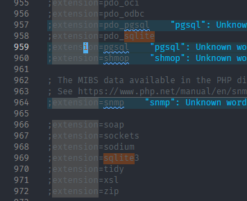

# Udhëzues instalimi dhe përdorimi

---

## Instalimi

### 1. Instalo PHP

* Shko tek https://windows.php.net/download/
* Shkarko **Non Thread Safe** — versioni 8.3
* Shpako tek `C:\php`

Konfirmo që PHP është instaluar:
```
php -v
```

---

### 2. Krijo php.ini

Në dosjen `C:\php`, ekzekuto:
```
Copy-Item php.ini-development php.ini
```

---

### 3. Konfiguro php.ini

Hap `C:\php\php.ini` dhe bëj ndryshimet e mëposhtme.

**Vendos extension_dir me shteg absolut** (i domosdoshëm në Windows):
```ini
extension_dir = "C:\php\ext"
```

**Aktivizo shtesat e nevojshme** — gjej dhe hiq `;` përpara çdo rreshti:

Shtesat e nevojshme në `php.ini`:
```ini
extension=curl
extension=openssl
extension=sockets
extension=pdo_sqlite
extension=sqlite3
extension_dir = "C:\php\ext"   ; duhet të jetë shteg absolut në Windows
upload_max_filesize = 10M
post_max_size = 12M
```

**Rrit kufirin e ngarkimit:**
```ini
upload_max_filesize = 10M
post_max_size = 12M
```

Konfirmo që shtesat janë aktive:
```
php -m
```

Duhet të shohësh në dalje: `curl`, `openssl`, `PDO`, `pdo_sqlite`, `sqlite3`.




---

### 4. Shto PHP në PATH

Për të ekzekutuar `php` nga çdo dosje në terminal:

* Hap **System Properties** → **Environment Variables**
* Tek **System Variables**, gjej `Path` → **Edit**
* Shto: `C:\php`
* Kliko OK dhe rinis terminalin

Konfirmo:
```
php -v
```

---

### 5. Merr projektin

Klono nga GitHub:
```
git clone https://github.com/username/Web-Project.git
cd Web-Project
```

Ose kopjo dosjen e projektit direkt në `Desktop\Web-Project`.

---

### 6. Konfiguro kredencialet

**Gmail SMTP** — krijo skedarin `config/mail.php` (ky skedar nuk është në git):
```php
<?php
define('MAIL_HOST',      'smtp.gmail.com');
define('MAIL_PORT',       587);
define('MAIL_USERNAME',  'emailijot@gmail.com');
define('MAIL_PASSWORD',  'fjalëkalimiiaplkacionit');   // 16 karaktere, pa hapësira
define('MAIL_FROM',      'emailijot@gmail.com');
define('MAIL_FROM_NAME', 'Sistemi i Menaxhimit të Skedarëve');
```

Për të marrë fjalëkalimin e aplikacionit nga Gmail:
1. Shko tek myaccount.google.com → Security
2. Aktivizo **Verifikimi me 2 hapa**
3. Kërko "App passwords" → krijo një për "Mail"
4. Kopjo 16 karakteret **pa hapësira**

**Claude API** (opsionale — për kërkim me AI):
```
set CLAUDE_API_KEY=sk-ant-...
```
Nëse nuk vendoset, kërkimi funksionon normalisht pa renditje me AI.

---

## Nisja e serverit

Hap terminalin dhe shko tek dosja e projektit:
```
cd C:\Users\User\Desktop\Web-Project
```

Nis serverin:
```
php -S localhost:8000
```

Hap në shfletues:
```
http://localhost:8000
```

Për akses nga kompjuterë të tjerë në të njëjtin rrjet (p.sh. gjatë prezantimit):
```
php -S 0.0.0.0:8000
```

---

## Të dhëna demo (opsionale)

Për të ngarkuar strukturën e dosjeve dhe skedarëve të testimit për prezantim, ekzekuto në shfletues ndërkohë që je i kyçur:
```
http://localhost:8000/seed_demo.php
```

Krijon:
```
📁 Demo Project
  📂 Demo 1
    📂 Demo 1.1
      📄 Demo 1.1.1, Demo 1.1.2
    📄 Demo 1.2, Demo 1.3
  📂 Demo 2
    📂 Demo 2.1
      📄 Demo 2.1.1
    📄 Demo 2.2
  📂 Demo 3
    📄 Demo 3.1, Demo 3.2
```

Mund të ekzekutohet më shumë herë — fshin të dhënat e mëparshme dhe i rindërton.

---

## Probleme të zakonshme

**`Database connection error: could not find driver`**
`pdo_sqlite` ose `extension_dir` nuk janë konfiguruar siç duhet në `php.ini`. Kontrollo që `extension_dir` ka shteg absolut dhe nuk është me `;` përpara.

**`localhost can't currently handle this request`**
`openssl`, `curl` ose `sockets` janë të çaktivizuara. Hiq `;` përpara të trijave në `php.ini` dhe rinis serverin.

**Skedari nuk ngarkohet (mbi 2 MB)**
`upload_max_filesize` është ende 2M. Konfirmo që `upload_max_filesize = 10M` dhe `post_max_size = 12M` janë vendosur dhe serveri është rinisur.

**SMTP authentication failed**
Fjalëkalimi i aplikacionit është kopjuar me hapësira. Gmail e shfaq në grupe prej 4 karakteresh — vendose pa hapësira në `config/mail.php`.

Shiko `_debugging.md` për historikun e plotë të problemeve dhe zgjidhjeve.
