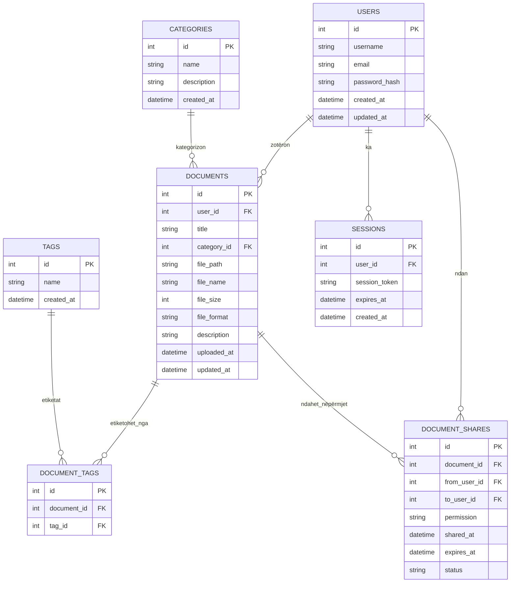
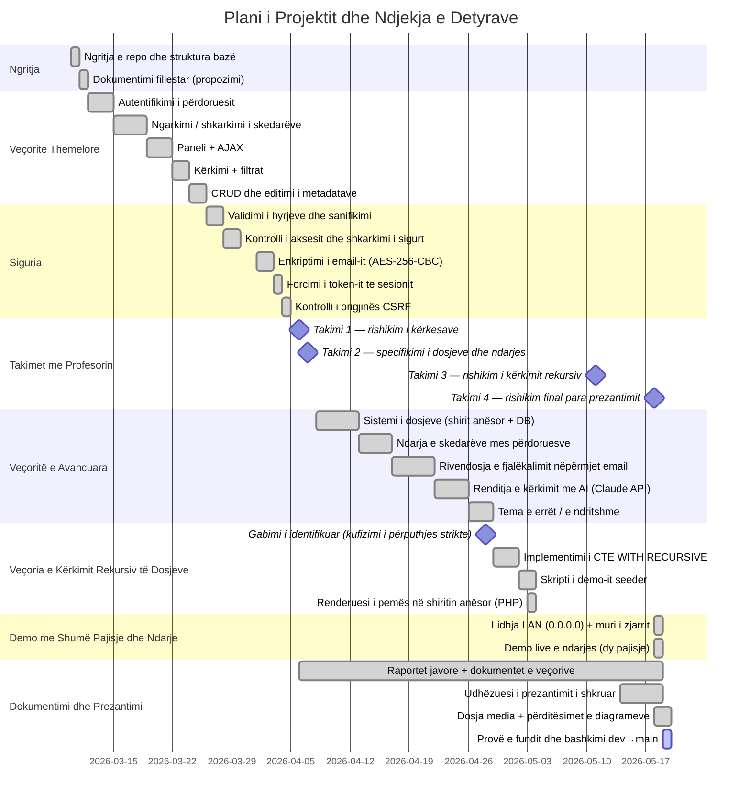

# Diagramet

## Diagramet e Sistemit

### 1. Arkitektura e Nivelit të Lartë (Mermaid)

```mermaid
flowchart LR
    Browser[Shfletuesi i Përdoruesit]
    Server[Serveri Web (PHP)]
    DB[Baza e të Dhënave SQLite]
    Uploads[Dosja e Ngarkimeve]

    Browser -- HTTP(S) --> Server
    Server -- SQL --> DB
    Server -- Lexim/Shkrim --> Uploads

    subgraph App
        Server
        DB
        Uploads
    end
```

### 2. Skema e Bazës së të Dhënave (Mermaid ERD)



> **Shënim:** Ky dizajn ndjek formën e tretë normale (3NF) duke mbajtur entitetet të ndara (përdorues, dokumente, etiketa, kategori) dhe duke përdorur tabela lidhëse për relacionet shumë-me-shumë.

## Menaxhimi i Punës në Grup

### 1. Mjetet për bashkëpunim dhe menaxhim kodi
- **Kontrolli i versioneve dhe bashkëpunimi i kodit:** Git + GitHub (ose GitLab/Bitbucket)
- **Ndjekja e detyrave:** GitHub Issues / Projects, Trello, ose tabela të ngjashme Kanban
- **Komunikimi:** Slack / Microsoft Teams / Discord / Email
- **Dokumentimi:** Skedarë Markdown në `.EN_Docs/` + README

### 2. Planifikimi dhe ndjekja e projektit (Kryetari i grupit)
Kryetari i grupit krijon një **plan projekti** dhe monitoron ecurinë duke përdorur një **grafik Gantt** për detyrat e përditësuara.

#### Grafiku Gantt (Mermaid)


### 3. Raporti javor (Personi i kontaktit)
Personi i kontaktit duhet të përgatisë **raport javor** mbi mbledhjet, diskutimet dhe vendimet e marra brenda grupit (shiko skedarët e raporteve).
