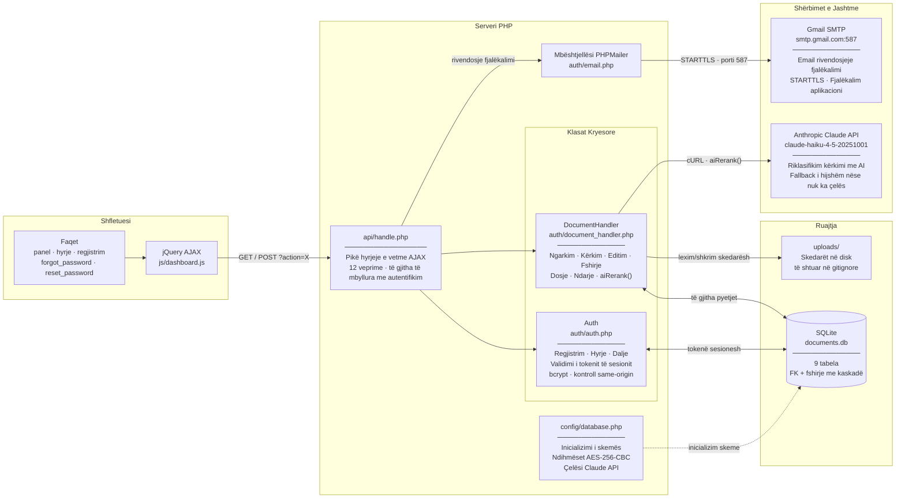
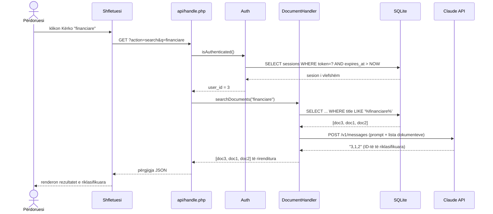
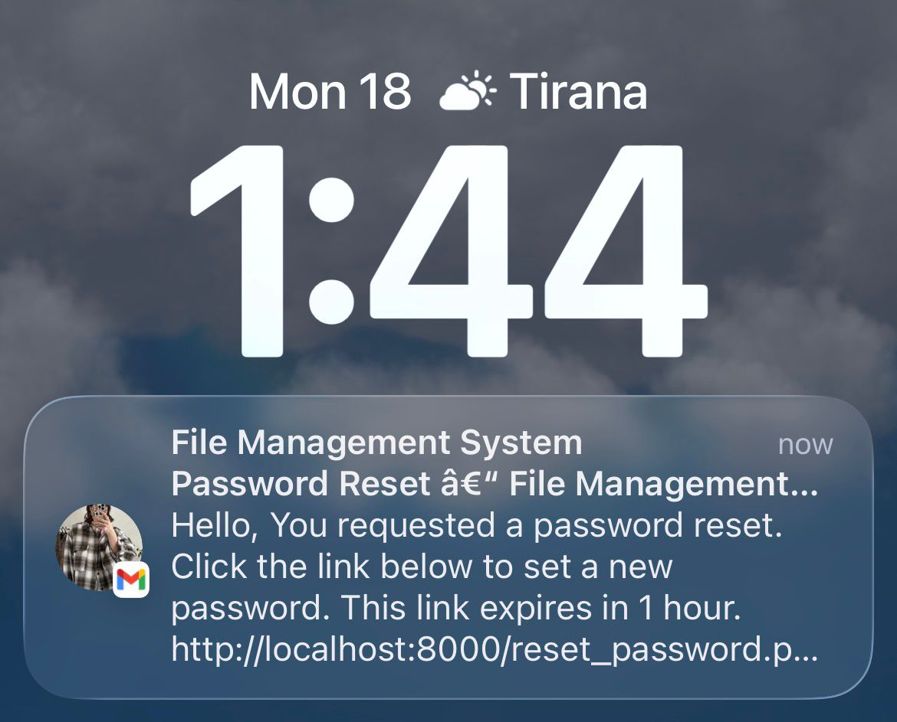
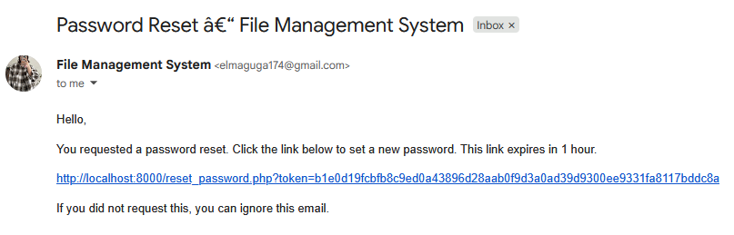

# Sistemi i Menaxhimit të Dokumenteve — Klasa e Zhvillimit Web

## Instalimi & Nisja

Referohuni: _installation.md

---

## Lista e Veçorive

- [x] Autentifikimi
    - [x] Regjistrim / Hyrje / Dalje  `auth/auth.php`
    - [x] Tokenët e sesionit (ruajtur në DB, skadon pas 24h)  tabela `sessions`
- [x] Ngarkim i sigurt skedarësh  `auth/document_handler.php`, `api/handle.php`
    - [x] Kategoritë & Etiketat
    - [x] Listimi, Filtrimi, Fshirja e skedarëve
- [x] Paneli + AJAX  `dashboard.php`, `js/dashboard.js`
- [x] Shkarkim i sigurt skedarësh  `download.php`  (i mbyllur me autentifikim, pa rrugë të papërpunuar të ekspozuar)
- [x] Editimi i metadatave të dokumentit inline  (modal në panel)
- [x] Sistemi i dosjeve me ikona skedarësh  tabela `folders`, shiriti anësor në panel
- [x] Ndarja e skedarëve mes përdoruesve  tabela `shares`
- [x] Integrimi i Claude API për kërkim të riklasifikuar me AI  `auth/document_handler.php → aiRerank()`
- [x] Rivendosja e fjalëkalimit nëpërmjet email-it  `forgot_password.php`, `reset_password.php`, PHPMailer

---

## Shpjegimi i Nocioneve Bazë të Përdorura

**API**
Një kontratë mes dy programeve: njëri ekspozon URL-të (pikat fundore) që pranojnë kërkesa në një format të përcaktuar dhe kthejnë përgjigje të strukturuara (zakonisht JSON). Ky projekt përdor API-t në dy drejtime:
- *Brenda*: shfletuesi thërret `api/handle.php` tonin nëpërmjet AJAX
- *Jashtë*: PHP-ja jonë thërret Claude API dhe Gmail SMTP

**SESSION**
`$_SESSION` e PHP-ës është thjesht një ruajtje çelës-vlerë nga ana e serverit e lidhur me një cookie në shfletues. Ne e zgjerojmë atë me një token të mbështetur nga DB: gjatë hyrjes një token `bin2hex(random_bytes(32))` shkruhet në tabelën `sessions` dhe vendoset edhe në `$_SESSION['token']`. Me çdo kërkesë `Auth::isAuthenticated()` kontrollon që tokeni ekziston në DB dhe nuk ka skaduar.

**HANDLER**
Një klasë që zotëron të gjithë logjikën për një domen. `Auth` menaxhon përdoruesit dhe sesionet. `DocumentHandler` menaxhon gjithçka rreth skedarëve — ngarkim, listim, kërkim, editim, ndarje, dosje. `api/handle.php` është trajtues i nivelit HTTP: një pikë hyrjeje e vetme që lexon `?action=X` dhe rruton tek metoda e duhur.

**cURL**
Biblioteka e PHP-ës për të bërë kërkesa HTTP dalëse. E përdorim në `aiRerank()` për të thirrur pikën fundore të Anthropic API. `curl_init()` → `curl_setopt()` (kokëzat, trupi, metoda) → `curl_exec()` → `curl_close()`.

**GET / POST**
- `GET`: lexon të dhëna, parametrat janë në URL (`?search=faturat`). Përdoret për: listimin e dokumenteve, marrjen e dosjeve, kërkimin.
- `POST`: dërgon të dhëna në trupin e kërkesës (jo URL-në). Përdoret për: ngarkim, hyrje, fshirje, editim, ndarje. Çdo gjë që muton gjendjen duhet të jetë POST.

---


## Pamje e Përgjithshme e Kodit

### Rafte Teknologjik

* PHP 7.4+ (server i integruar: `php -S localhost:8000`)
* SQLite 3 nëpërmjet PDO (`pdo_sqlite`, zgjerimi `sqlite3`)
* jQuery (kopje lokale në `js/jquery.min.js` — CDN i paarritshëm në rrjet lokal)
* PHPMailer (`lib/PHPMailer/`) për Gmail SMTP
* Anthropic Claude API (`claude-haiku-4-5-20251001`) për riklasifikimin e kërkimit me AI


## Struktura e Skedarëve

```
Web-Project/
│
├── index.php                  → ridrejton tek hyrja ose paneli
├── login.php                  → formulari i hyrjes + lidhja "Keni harruar fjalëkalimin?"
├── register.php               → formulari i regjistrimit
├── logout.php                 → shkatërron sesionin, ridirekton
├── dashboard.php              → pamja kryesore e aplikacionit (tabela, shiriti anësor, modalët)
├── download.php               → trajtues shkarkimi i skedarëve i mbyllur me autentifikim
├── forgot_password.php        → formulari i hyrjes së email-it → gjeneron token rivendosjeje
├── reset_password.php         → valididon tokenin → formulari i ndryshimit të fjalëkalimit
├── edit_document.php          → (faqe e vjetër standalonë, e zëvendësuar nga modal)
│
├── api/
│   └── handle.php             → pikë hyrjeje e vetme AJAX, rruton sipas ?action=
│
├── auth/
│   ├── auth.php               → klasa Auth: regjistrim, hyrje, dalje, kontroll sesioni
│   ├── document_handler.php   → klasa DocumentHandler: gjithë logjika e skedarëve + dosjeve + ndarjes
│   └── email.php              → mbështet sendEmail() duke përdorur PHPMailer
│
├── config/
│   ├── database.php           → lidhja PDO, inicializimi i skemës, ndihmëset e enkriptimit
│   └── mail.php               → kredencialet Gmail SMTP (e shtuar në gitignore)
│
├── lib/
│   └── PHPMailer/             → PHPMailer.php, SMTP.php, Exception.php
│
├── js/
│   ├── jquery.min.js          → kopje lokale e jQuery
│   └── dashboard.js           → të gjitha thirrjet AJAX, trajtuesit e modalëve, renderimi i tabelës
│
├── css/
│   └── style.css              → paraqitja, modalët, shiriti i skedave, pema e dosjeve, ikonat
│
├── data/                      → i shtuar në gitignore
│   ├── documents.db           → skedari i bazës së të dhënave SQLite
│   └── mail.log               → log gabimesh i PHPMailer
│
├── uploads/                   → i shtuar në gitignore — skedarët e ngarkuar aktualë
│
├── .htaccess                  → bllokon aksesin direkt të shfletuesit tek auth/, config/, data/, uploads/
├── .gitignore
└── .docs/                     → gjithë dokumentacioni i projektit
```


### Baza e të Dhënave


```sql
-- Përdoruesit: ruan kredencialet + emailin e enkriptuar
CREATE TABLE IF NOT EXISTS users (
  id          INTEGER PRIMARY KEY AUTOINCREMENT,
  username    TEXT UNIQUE NOT NULL,
  email       TEXT NOT NULL,          -- enkriptuar AES-256-CBC, i koduar base64
  email_hash  TEXT UNIQUE NOT NULL,   -- SHA-256 i email-it me shkronja të vogla, përdoret për kërkime
  password    TEXT NOT NULL,          -- bcrypt nëpërmjet password_hash()
  created_at  DATETIME DEFAULT CURRENT_TIMESTAMP,
  updated_at  DATETIME DEFAULT CURRENT_TIMESTAMP
);

-- Sesionet: tokenë të mbështetur nga DB (më të sigurt se sesioni PHP vetëm)
CREATE TABLE IF NOT EXISTS sessions (
  id            INTEGER PRIMARY KEY AUTOINCREMENT,
  user_id       INTEGER NOT NULL,
  session_token TEXT UNIQUE NOT NULL, -- bin2hex(random_bytes(32))
  expires_at    DATETIME NOT NULL,    -- 24 orë nga krijimi
  created_at    DATETIME DEFAULT CURRENT_TIMESTAMP,
  FOREIGN KEY (user_id) REFERENCES users(id) ON DELETE CASCADE
);

-- Kategoritë: Bileta, Kontrata, Raporte, Tjetër (të mbjellur)
CREATE TABLE IF NOT EXISTS categories (
  id          INTEGER PRIMARY KEY AUTOINCREMENT,
  name        TEXT UNIQUE NOT NULL,
  description TEXT,
  created_at  DATETIME DEFAULT CURRENT_TIMESTAMP
);

-- Dokumentet: një rresht për çdo skedar të ngarkuar
CREATE TABLE IF NOT EXISTS documents (
  id          INTEGER PRIMARY KEY AUTOINCREMENT,
  user_id     INTEGER NOT NULL,
  title       TEXT NOT NULL,
  category_id INTEGER,
  file_path   TEXT NOT NULL,          -- rruga e serverit (kurrë e ekspozuar tek klienti)
  file_name   TEXT NOT NULL,          -- emri origjinal i skedarit
  file_size   INTEGER NOT NULL,       -- bytes
  file_format TEXT NOT NULL,          -- shtesa (pdf, docx, jpg…)
  description TEXT,
  folder_id   INTEGER DEFAULT NULL,   -- FK tek folders (shtuar nëpërmjet ALTER TABLE)
  uploaded_at DATETIME DEFAULT CURRENT_TIMESTAMP,
  updated_at  DATETIME DEFAULT CURRENT_TIMESTAMP,
  FOREIGN KEY (user_id) REFERENCES users(id) ON DELETE CASCADE,
  FOREIGN KEY (category_id) REFERENCES categories(id) ON DELETE SET NULL
);

-- Etiketat: etiketa me format të lirë
CREATE TABLE IF NOT EXISTS tags (
  id         INTEGER PRIMARY KEY AUTOINCREMENT,
  name       TEXT UNIQUE NOT NULL,
  created_at DATETIME DEFAULT CURRENT_TIMESTAMP
);

-- document_tags: lidhja shumë-me-shumë
CREATE TABLE IF NOT EXISTS document_tags (
  id          INTEGER PRIMARY KEY AUTOINCREMENT,
  document_id INTEGER NOT NULL,
  tag_id      INTEGER NOT NULL,
  UNIQUE(document_id, tag_id),
  FOREIGN KEY (document_id) REFERENCES documents(id) ON DELETE CASCADE,
  FOREIGN KEY (tag_id)      REFERENCES tags(id)      ON DELETE CASCADE
);

-- Dosjet: mbështet vendosjen në fole nëpërmjet parent_id (NULL = rrënjë)
CREATE TABLE IF NOT EXISTS folders (
  id         INTEGER PRIMARY KEY AUTOINCREMENT,
  name       TEXT NOT NULL,
  user_id    INTEGER NOT NULL,
  parent_id  INTEGER DEFAULT NULL,
  created_at DATETIME DEFAULT CURRENT_TIMESTAMP,
  FOREIGN KEY (user_id)   REFERENCES users(id)   ON DELETE CASCADE,
  FOREIGN KEY (parent_id) REFERENCES folders(id) ON DELETE SET NULL
);

-- Ndarja: document_id + shared_with_user_id duhet të jetë unik (nuk lejohen ndaje dyfishe)
CREATE TABLE IF NOT EXISTS shares (
  id                   INTEGER PRIMARY KEY AUTOINCREMENT,
  document_id          INTEGER NOT NULL,
  owner_id             INTEGER NOT NULL,
  shared_with_user_id  INTEGER NOT NULL,
  permission           TEXT DEFAULT 'read',
  created_at           DATETIME DEFAULT CURRENT_TIMESTAMP,
  UNIQUE(document_id, shared_with_user_id),
  FOREIGN KEY (document_id)         REFERENCES documents(id) ON DELETE CASCADE,
  FOREIGN KEY (owner_id)            REFERENCES users(id)     ON DELETE CASCADE,
  FOREIGN KEY (shared_with_user_id) REFERENCES users(id)     ON DELETE CASCADE
);

-- Rivendsjet e fjalëkalimit: tokenë me një përdorim me skadhim 1h
CREATE TABLE IF NOT EXISTS password_resets (
  id         INTEGER PRIMARY KEY AUTOINCREMENT,
  user_id    INTEGER NOT NULL,
  email_hash TEXT NOT NULL,           -- SHA-256, përdoret për të gjetur përdoruesin
  token      TEXT UNIQUE NOT NULL,    -- bin2hex(random_bytes(32))
  expires_at DATETIME NOT NULL,       -- TANI + 1 orë
  used       INTEGER DEFAULT 0,       -- 1 pas shpenzimit
  created_at DATETIME DEFAULT CURRENT_TIMESTAMP,
  FOREIGN KEY (user_id) REFERENCES users(id) ON DELETE CASCADE
);
```

### Enkriptimi i Email-it

Email-et ruhen të enkriptuara (AES-256-CBC) kështu që skedari DB nuk zbulon adresat. Kërkimet përdorin një hash SHA-256 në vend të tekstit të qartë.

```php
// config/database.php
define('ENCRYPTION_KEY', getenv('ENCRYPTION_KEY') ?: 'change_me_to_a_random_secret');
define('ENCRYPTION_METHOD', 'AES-256-CBC');

// Enkriptimi para INSERT
$encryptedEmail = encryptValue($email);  // → base64(IV + ciphertext)
$emailHash      = hash('sha256', strtolower(trim($email)));

// Kërkim pa dekriptuar
SELECT * FROM users WHERE email_hash = :hash

// Dekriptimi gjatë shfaqjes
$plainEmail = decryptValue($row['email']);
```

`decryptValue()` përdor `base64_decode($value, true)` (modaliteti strikt) — nëse vlera e ruajtur nuk është base64 e vlefshme (p.sh. email me tekst të qartë para se openssl të aktivizohej), kthen vlerën e papërpunuar në vend që të rrëzohet.

---

### Pikat Fundore të API — `api/handle.php`

Të gjitha thirrjet shkojnë tek një skedar i vetëm. `?action=X` rruton tek logjika e duhur. Të gjitha kërkojnë një sesion aktiv (401 nëse jo).

| Veprimi | Metoda | Çfarë bën |
|---------|--------|-----------|
| `upload` | POST | Valididon + ruan skedarin, ruan metadatat në DB |
| `get_documents` | GET | Kthen të gjitha dokumentet për përdoruesin aktual (me filtra) |
| `search` | GET | Kërkim me fjalë kyçe + riklasifikim AI nëpërmjet Claude |
| `delete` | POST | Fshin skedarin dhe regjistrimin DB (kontroll pronësie) |
| `get_tags` | GET | Kthen të gjitha etiketat |
| `get_categories` | GET | Kthen të gjitha kategoritë |
| `edit_document` | POST | Përditëson titullin, kategorinë, etiketat, përshkrimin |
| `create_folder` | POST | Fut dosje të re për përdoruesin aktual |
| `get_folders` | GET | Kthen të gjitha dosjet për përdoruesin aktual |
| `get_folder_documents` | GET | Kthen dokumentet brenda një dosjeje specifike |
| `share_document` | POST | Ndan një dokument me një përdorues tjetër sipas emrit |
| `get_shared_documents` | GET | Kthen dokumentet e ndara me përdoruesin aktual |

---

### Metodat e DocumentHandler — `auth/document_handler.php`

| Metoda | Përshkrimi |
|--------|------------|
| `uploadFile($title, $category_id, $tags, $file, $folder_id)` | Valididon, zhvendos skedarin, INSERT document + tags |
| `getDocuments($filters)` | SELECT me filtra opsionalë kategorie/etikete/kërkimi |
| `searchDocuments($query)` | Kërkim SQL LIKE → kalon rezultatet tek `aiRerank()` |
| `deleteDocument($id)` | Kontroll pronësie → DELETE skedar + rresht DB |
| `editDocument($id, $title, $categoryId, $desc, $tags)` | UPDATE + fshi etiketat e vjetra + ri-shto etiketat |
| `createFolder($name, $parentId)` | INSERT në folders |
| `getFolders()` | SELECT WHERE user_id = aktual |
| `getFolderDocuments($folderId)` | SELECT WHERE folder_id = ? AND (i zotëruar OSE i ndarë) |
| `shareDocument($docId, $targetUsername)` | Verifiko pronësinë, zgjidh emrin e përdoruesit → id, INSERT share |
| `getSharedDocuments()` | SELECT nëpërmjet shares WHERE shared_with_user_id = aktual |
| `aiRerank($query, $docs)` | cURL tek Claude API, kthen dokumentet të rirenditura sipas rëndësisë |

---

### Rrjedha e Autentifikimit

```
Regjistrimi:
  POST /register.php
    → valididon fushat
    → password_hash()
    → encryptValue(email) + hash('sha256', email)
    → INSERT users
    → ridrejton login.php

Hyrja:
  POST /login.php
    → hash('sha256', email) → SELECT user
    → password_verify()
    → bin2hex(random_bytes(32)) → INSERT sessions
    → $_SESSION['token'] = token
    → ridrejton dashboard.php

Çdo kërkesë:
  Auth::isAuthenticated()
    → SELECT sessions WHERE token = $_SESSION['token'] AND expires_at > NOW
    → nëse nuk gjendet → ridrejton login.php

Dalja:
  DELETE sessions WHERE token = aktual
  → session_destroy()
  → ridrejton login.php
```

---

### Rrjedha e Rivendosjes së Fjalëkalimit

```
forgot_password.php (GET)  →  tregon formularin e email-it

forgot_password.php (POST)
  → hash('sha256', email) → SELECT user by email_hash
  → bin2hex(random_bytes(32)) token
  → INSERT password_resets (expires_at = NOW + 1h)
  → sendEmail() → PHPMailer → smtp.gmail.com:587 → inbox
  → tregon konfirmimin "Kontrolloni email-in tuaj"

reset_password.php (GET ?token=...)
  → SELECT password_resets WHERE token = ? AND used = 0 AND expires_at > NOW
  → nëse jo e vlefshme → tregon gabim
  → nëse e vlefshme    → tregon formularin e fjalëkalimit të ri

reset_password.php (POST)
  → valididon: fjalëkalimet përputhen, min 6 karaktere
  → password_hash() → UPDATE users SET password
  → UPDATE password_resets SET used = 1
  → ridrejton login.php?reset=1
```

---

### Rrjedha e Kërkimit AI

```
GET api/handle.php?action=search&q=financiare

  → searchDocuments("financiare")
      → SQL: SELECT ... WHERE title LIKE '%financiare%' OR tags LIKE ...
      → rezultati i papërpunuar: [{id:3, title:"Raporti Q4"}, {id:1, title:"Faturë"}, ...]

  → aiRerank("financiare", $docs)           ← vetëm nëse CLAUDE_API_KEY është vendosur
      → ndërto prompt:
          "Pyetja e kërkimit: "financiare"
           Dokumentet:
           3: Raporti Q4 [Raporte] financa tremujore
           1: Faturë Jan [Kontrata] faturim
           ...
           Ktheni ID-të në rendin e rëndësisë, të ndara me presje."
      → cURL POST https://api.anthropic.com/v1/messages
          kokëzat: x-api-key, anthropic-version: 2023-06-01
          trupi: {model: "claude-haiku-4-5-20251001", messages: [...]}
      → Claude përgjigjet: "3,1,2"
      → dokumentet rirenditura sipas asaj sekuence ID

  → përgjigja JSON tek shfletuesi
```

Nëse `CLAUDE_API_KEY` është bosh ose thirrja cURL dështon → kthehet rendi origjinal SQL i pandryshuar. Kërkimi vazhdon të funksionojë.





---

### Shënime Sigurie

| Shqetësimi | Implementimi |
|------------|-------------|
| Fjalëkalimet | `password_hash()` bcrypt, kurrë nuk ruhen si tekst i qartë |
| Sesionet | Token DB (`bin2hex(random_bytes(32))`), skadon pas 24h |
| Email në qetësi | Enkriptuar AES-256-CBC, vetëm hashi përdoret për kërkime |
| Shkarkimi | `download.php` kontrollon pronësinë/lejen para se të shërbejë ndonjë skedar |
| Ngarkimet | Lista e lejuar e shtesave, kufiri i madhësisë (10 MB), emri i skedarit `uniqid()` në disk |
| CSRF | `isSameOriginRequest()` kontrollon hostin e referer-it mbi të gjitha veprimet POST |
| Aksesi i drejtorisë | `.htaccess` mohon aksesin e shfletuesit tek `auth/`, `config/`, `data/`, `uploads/` |
| Çelësat API | `config/mail.php` i shtuar në gitignore; çelësi Claude nëpërmjet `getenv()` (kurrë në disk) |
| Tokenët e rivendosjes | Me një përdorim, skadon pas 1h, `bin2hex(random_bytes(32))` |

---

### Gabimet e Njohura të Rregulluara

| Gabimi | Shkaku rrënjësor | Rregullimi |
|--------|-----------------|------------|
| Hyrja "Aksesi i Mohuar" | `isSameOriginRequest()` krahasonte `localhost` me `localhost:8000` (mospërputhje porti) | Mbështjell `HTTP_HOST` në `parse_url()` kështu që porti hiqet nga të dyja anët |
| Ngarkimi dorëzon si GET | jQuery CDN i paarritshëm lokalisht → `e.preventDefault()` nuk ekzekutohej kurrë | Shkarko jQuery tek `js/jquery.min.js`; shto `method="POST"` në formular |
| Skedarët mbi 2 MB refuzohen pa zhurmë | `upload_max_filesize = 2M` parazgjedhje në `php.ini` | Rrit në `10M`, `post_max_size` në `12M` |
| PHPMailer TLS dështon | `openssl`, `curl`, `sockets` të komentuar në `php.ini` | Hiq komentet nga të tria; `extension_dir` absolute në Windows |
| Gmail SMTP auth dështon | Fjalëkalimi i aplikacionit i kopjuar me hapësira (`abcd efgh…`) | Hiq të gjitha hapësirat nga `MAIL_PASSWORD` në `config/mail.php` |
| Paralajmërim `openssl_decrypt IV 12 bytes` | Email-et me tekst të qartë të ruajtura para se openssl të aktivizohej — `base64_decode` i një email-i me tekst të qartë është më i shkurtër se IV 16-bajt | Përdor `base64_decode($v, true)` strikt; kthe vlerën si është nëse false ose shumë e shkurtër |


---

### Hapi 1 — Sistemi i Autentifikimit

**Trego:** `http://localhost:8000/register.php`

1. Plotëso emrin e përdoruesit, email-in, fjalëkalimin → kliko **Regjistrohu**
2. Ridirekton tek hyrja — thekso që sistemi nuk të hyn automatikisht (qëllimisht: ndarje e regjistrimit dhe autentifikimit)
3. Hyr me kredencialet e reja → zbarkoi në panel
4. **Fol për:** tokenët e sesionit — çdo kërkesë pas hyrjes validohet kundrejt tabelës `sessions` në DB, jo vetëm një cookie. Trego butonin e daljes dhe shpjego që tokeni fshihet nga ana e serverit, jo vetëm pastrohet nga ana e klientit.

**Skedarët kryesorë:**

| Skedari | Çfarë bën |
|---------|----------|
| `register.php` | Formulari i regjistrimit — mbledh emrin e përdoruesit, email-in, fjalëkalimin |
| `login.php` | Formulari i hyrjes — valididon kredencialet, lëshon token sesioni |
| `auth/auth.php` | `register()` hash-on fjalëkalimin me bcrypt, enkrpton email-in AES-256-CBC, ruan hash SHA-256 për kërkime; `login()` valididon kredencialet dhe shkruan një token `bin2hex(random_bytes(32))` në tabelën `sessions`; `logout()` fshin tokenin nga ana e serverit |
| `config/database.php` | `encryptValue()` / `decryptValue()` — ndihmëse AES-256-CBC; `initializeDatabase()` — krijon të gjitha 9 tabelat në ekzekutimin e parë |

---

### Hapi 2 — Rivendosja e Fjalëkalimit nëpërmjet Email-it

**Trego:** Dil nga llogaria fillimisht → `http://localhost:8000/login.php` → kliko **"Keni harruar fjalëkalimin?"**

1. Fut adresën e email-it të regjistruar → kliko **Dërgo Lidhjen e Rivendosjes**
2. Hap kutinë e postës — trego email-in që mbërrin nga sistemi



3. Kliko lidhjen e rivendosjes → zbarkoi në formularin e fjalëkalimit të ri



4. Fut fjalëkalimin e ri → ridirektohet tek hyrja me mesazh suksesi


5. Hyr me fjalëkalimin e ri


6. **Fol për:** tokeni është një varg 64-karakterësh `bin2hex(random_bytes(32))` i ruajtur në `password_resets` me skadhim 1 orë dhe një flamur `used` — pasi klikohet nuk mund të përdoret më. Adresa e email-it në DB është e enkriptuar AES-256-CBC; kërkimi përdor hash SHA-256 në vend të tekstit të qartë.

**Skedarët kryesorë:**

| Skedari | Çfarë bën |
|---------|----------|
| `forgot_password.php` | Formulari që pranon adresën e email-it dhe aktivizon rrjedhën e rivendosjes |
| `reset_password.php` | Valididon tokenin nga lidhja, renderon formularin e fjalëkalimit të ri |
| `auth/auth.php` | `initiatePasswordReset()` gjeneron tokenin, e ruan me skadhim 1 orë, thërret `sendEmail()`; `resetPassword()` kontrollon që tokeni është i vlefshëm, i papërdorur dhe jo i skaduar para se të përditësojë hash-in |
| `auth/email.php` | Mbështjellësi PHPMailer — STARTTLS mbi portin 587 tek Gmail SMTP; ndërton dhe dërgon email-in e rivendosjes me lidhjen e nënshkruar |
| `config/database.php` | `hashValue()` (SHA-256) përdoret për të gjetur email-in e enkriptuar pa e dekriptuar atë |

---

### Hapi 3 — Ngarkim Skedarësh + Struktura Rekursive e Dosjeve

#### 3.1 — Mbill të dhënat e demos

**Trego:** `http://localhost:8000/seed_demo.php`

Skripti i mbjelljeve është një mjet njëherë që popullura bazën e të dhënave me një pemë të njohur dosjesh dhe 8 skedarë `.txt` realë me një kërkesë të vetme — pa klikime manuale nëpër UI. Kontrollon fillimisht për një sesion aktiv, fshi çdo ekzekutim të mëparshëm (skedarët në disk përfshirë), pastaj fut dosjet dhe dokumentet programatikisht. Kjo është praktikë standarde në zhvillimin web për të ngritur gjendje demo të riprodhueshme.

Skripti ndërton këtë pemë për përdoruesin aktual të hyrë:

```
📁 Projekti Demo
  📂 Demo 1
    📂 Demo 1.1
      📄 Demo 1.1.1 · Demo 1.1.2
    📄 Demo 1.2 · Demo 1.3
  📂 Demo 2
    📂 Demo 2.1
      📄 Demo 2.1.1
    📄 Demo 2.2
  📂 Demo 3
    📄 Demo 3.1 · Demo 3.2
```

Pasi ekzekutohet, kliko **← Shko tek Paneli**.


#### 3.2 — Ngarko një skedar manualisht

**Trego:** Paneli → shiriti anësor i ngarkimit në të majtë

Zgjidh ndonjë skedar nga `demo-files/` (p.sh. `faturë_janar.txt`) dhe ngarkoje me titull dhe kategori. Tabela përditësohet menjëherë nëpërmjet AJAX — pa rifreskim faqeje. Thekso këtë: formulari dorëzohet në sfond dhe vetëm tabela ri-renderohet.

**Fol për:** skedarët ruhen me emër të gjeneruar `uniqid()` në disk kështu që emri origjinal nuk mund të merret me mend ose të numërohet. Shkarkimi kalon nëpërmjet `download.php` i cili kontrollon pronësinë para se të shërbejë, rruga e papërpunuar e skedarit kurrë nuk ekspozohet në shfletues.

**Skedarët kryesorë:**

| Skedari | Çfarë bën |
|---------|----------|
| `dashboard.php` | Renderon formularin e ngarkimit dhe tabelën e dokumenteve; `renderDocumentsTable()` ndërton HTML-në nga ana e serverit në ngarkimin e parë |
| `api/handle.php` | `action=upload` valididon shtesën kundrejt listës së lejuar, zbaton kufirin 10 MB, ruan skedarin me emër `uniqid()`, fut metadatat në `documents` dhe etiketat në `document_tags` |
| `auth/document_handler.php` | `getUserDocuments()` merr dokumentet me kategori dhe të dhëna etiketash të bashkuara; `deleteDocument()` heq skedarin nga disku dhe DB |
| `download.php` | Shpërndarje skedarësh e mbyllur me autentifikim — verifikon pronësinë para se të lexojë skedarin; kurrë nuk ekspozon rrugën reale |
| `js/dashboard.js` | Dorëzon formularin e ngarkimit nëpërmjet `FormData` + `$.ajax`; me sukses ri-renderon vetëm tabelën e dokumenteve pa rifreskim faqeje |

#### 3.3 — Demonstro kërkimin rekursiv të dosjeve

**Trego:** Shiriti anësor i dosjeve në të majtë

1. Kliko **Demo 1.1** (dosje gjethe) → shfaqen 2 dokumente
2. Kliko **Demo 1** (prindër) → shfaqen 4 dokumente — 2 nga Demo 1.1 përfshihen
3. Kliko **Projekti Demo** (rrënjë) → shfaqen të gjitha 8 dokumentet nëpër të tre nivelet

**Fol për:** implementimi origjinal përdorte `WHERE folder_id = :id` — përputhje e saktë vetëm. Një skedar i vendosur në një nëndosje ishte i padukshëm nga çdo paraardhës. Rregullimi përdor një CTE rekursiv SQLite (`WITH RECURSIVE`) që kalon të gjithë nënpemën para se të marrë dokumentet. Klikimi i çdo dosjeje tani nxjerr gjithçka brenda saj në çdo thellësi.

**Skedarët kryesorë:**

| Skedari | Çfarë bën |
|---------|----------|
| `auth/document_handler.php` | `getFolderDocuments()` — ekzekuton CTE-në `WITH RECURSIVE subfolder_ids` për të mbledhur të gjitha ID-t e dosjeve pasardhëse, pastaj merr dokumentet në ndonjë prej tyre; `getFolders()` kthen listën e plotë të fqinjësisë për renderimin e shiritit anësor; `createFolder()` fut një dosje të re me `parent_id` opsional |
| `dashboard.php` | `renderFolderTree()` — funksion PHP rekursiv që kalon listën e fqinjësisë dhe renderon elementet e dosjeve me dhëmbëzim me `padding-left` të shkallëzuar sipas thellësisë |
| `js/dashboard.js` | `loadFolder(id)` — thirrje AJAX tek `action=get_folder_documents`; përditëson tabelën e dokumenteve në vend |
| `api/handle.php` | `action=get_folder_documents` delegon tek `getFolderDocuments()`; `action=create_folder` valididon emrin dhe thërret `createFolder()` |

---

### Hapi 4 — Akses me Shumë Pajisje + Ndarja e Dokumenteve

**Trego:** Dy pajisje në të njëjtin Wi-Fi — njëra si Përdoruesi A (laptopi pritës), tjetra si Përdoruesi B (pajisja e dytë)

#### 4.1 — Lidh pajisjen e dytë

1. Rinis serverin të lidhur me të gjitha ndërfaqet:
   ```bash
   php -S 0.0.0.0:8000
   ```
2. Gjej IP-në lokale të makinës pritëse:
   ```bash
   ipconfig
   # kërko adresën IPv4 nën adapterin Wi-Fi, p.sh. 192.168.1.45
   ```
3. Në pajisjen e dytë hap `http://192.168.1.45:8000` — aplikacioni i plotë ngarkohet nga e njëjta bazë të dhënash dhe dosje `uploads/`. Regjistro një llogari të dytë (Përdoruesi B) këtu.

**Fol për:** serveri i integruar PHP lidhet me `localhost` si parazgjedhje, gjë që pranon vetëm lidhje nga e njëjta makinë. Kalimi i `0.0.0.0` i thotë atij të dëgjojë mbi të gjitha ndërfaqet e rrjetit. I gjithë trafiku godet të njëjtën bazë të dhënash SQLite — nuk nevojitet replikim. Windows Firewall mund të duhet të lejojë portin 8000 për `php.exe` herën e parë.

**Skedarët kryesorë:**

| Skedari | Çfarë bën |
|---------|----------|
| `config/database.php` | Hap skedarin e vetëm SQLite në `data/documents.db` — çdo pajisje në rrjet lexon dhe shkruan të njëjtin skedar nëpërmjet PDO |
| `auth/auth.php` | `isSameOriginRequest()` valididon kokëzën `Referer` kundrejt hostit të serverit me çdo POST — funksionon saktë kur hosti është IP LAN dhe jo localhost |
| `.htaccess` | Bllokon aksesin direkt të shfletuesit tek `auth/`, `config/`, `data/`, `uploads/` — zbatohet pavarësisht se nga cili IP arrihet serveri |

#### 4.2 — Ndaj një dokument

**Trego:** Kthehu tek laptopi i Përdoruesit A (pritësi)

1. Në tabelën e dokumenteve, kliko butonin e gjelbër **Share** mbi çdo dokument
2. Shfaqet një modal — fut emrin e përdoruesit të Përdoruesit B → kliko **Share**
3. Një mesazh suksesi konfirmon që ndarja u regjistrua

**Trego:** Në pajisjen e dytë (Përdoruesi B), rifresko panelin → kliko skedën **Shared with Me** → dokumenti shfaqet

**Fol për:** tabela `shares` mban një çift `document_id` + `shared_with_user_id` me një kufizim `UNIQUE` — nuk mund ta ndash të njëjtin dokument me të njëjtin përdorues dy herë. `download.php` kontrollon `pronësia OSE leja e ndarjes` para se të shërbejë ndonjë skedar, kështu Përdoruesi B mund ta shkarkojë atë por nuk mund të shohë dokumentet e tjera të Përdoruesit A. Rruga e papërpunuar e skedarit kurrë nuk dërgohet te shfletuesi.

**Skedarët kryesorë:**

| Skedari | Çfarë bën |
|---------|----------|
| `auth/document_handler.php` | `shareDocument()` fut në `shares`; `getSharedDocuments()` bashkon `shares` → `documents` për skedën Shared |
| `api/handle.php` | `action=share` valididon që emri i përdoruesit të synuar ekziston, pastaj thërret `shareDocument()`; `action=get_shared` kthen listën e ndarë si JSON |
| `js/dashboard.js` | `openShareModal()` / `submitShare()` trajtojnë rrjedhën AJAX të modalit; `switchTab('shared')` ngarkon lenevisshëm listën e ndarë në klikimin e parë |
| `download.php` | Para se të shërbejë ndonjë skedar: `WHERE d.id = ? AND (d.user_id = ? OR d.id IN (SELECT document_id FROM shares WHERE shared_with_user_id = ?))` |

---

### Hapi 5 — Kërkim i Zgjeruar me AI

**Trego:** Kutia e kërkimit në krye të panelit

1. Shkruaj `financiare` → kliko Kërko
2. Rezultatet shfaqen — të tre dokumentet përputhen në një farë mase
3. **Thekso:** rendi nuk është thjesht alfabetik ose sipas datës së ngarkimit — Claude i ka riklasifikuar ato sipas rëndësisë semantike. Raporti Financiar Q1 duhet të renditet i pari sepse përmbajtja e tij ka të bëjë më drejtpërdrejt me financën, edhe pse fjala shfaqet në të tre.
4. Provo një kërkim të dytë: `marrëveshje ligjore` — kontrata duhet të shfaqet në krye edhe pse "marrëveshje ligjore" nuk shfaqet fjalë për fjalë në asnjë titull.
5. **Fol për:** pyetja e kërkimit dhe lista e dokumenteve dërgohen tek `api.anthropic.com/v1/messages` nëpërmjet cURL. Claude kthen një listë ID-sh të ndara me presje në rendin e rëndësisë. Nëse çelësi API nuk është vendosur ose thirrja dështon, kthehet rendi origjinal SQL i pandryshuar — veçoria degradohet me hijeshi.

**Skedarët kryesorë:**

| Skedari | Çfarë bën |
|---------|----------|
| `auth/document_handler.php` | `searchDocuments()` ekzekuton një pyetje SQL `LIKE` nëpër titull, përshkrim dhe etiketa; `aiRerank()` ndërton promptin Claude, thërret API-n nëpërmjet cURL, analizon sekuencën e ID-ve të kthyera dhe rirendit `$docs` për të përputhur |
| `api/handle.php` | `action=search` thërret `searchDocuments()` pastaj `aiRerank()` dhe kthen listën e renditur si JSON |
| `js/dashboard.js` | Pret dorëzimin e formularit të kërkimit, aktivizon `action=search` nëpërmjet AJAX dhe ri-renderon tabelën e dokumenteve me rezultatet e renditura |
| `dashboard.php` | Rruga e kërkimit nga ana e serverit (parametrat GET) thërret gjithashtu `aiRerank()` kështu që renditja zbatohet edhe gjatë ngarkimit direkt të faqes me URL `?search=` |
