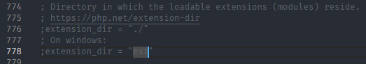

# Manual instalimi dhe perdorimi

## Instalimi

### Konfigurimi i PHP

* Instalo PHP tek https://windows.php.net/download/
* Shkarko "Non Thread Safe" tek varianti 8.3.
* Unzip tek C:\


Konfirmo qe PHP eshte e instaluar
```
php -v
```

Shkruani komanden:
```
Copy-Item php.ini-development php.ini
```
Per te krijuarj php.ini tek folderi php.





Tek `php.ini` beni uncomment:
```
extension=pdo_sqlite
extension=sqlite3
```
Pasi fusim komanden `php -m` duhet te shohim nje output te tille:

```
php -m
[PHP Modules]
bcmath
calendar
Core
ctype
date
dom
filter
hash
iconv
json
libxml
mysqlnd
pcre
PDO
pdo_sqlite
Phar
random
readline
Reflection
session
SimpleXML
SPL
sqlite3
standard
tokenizer
xml
xmlreader
xmlwriter
zlib

[Zend Modules]
```
