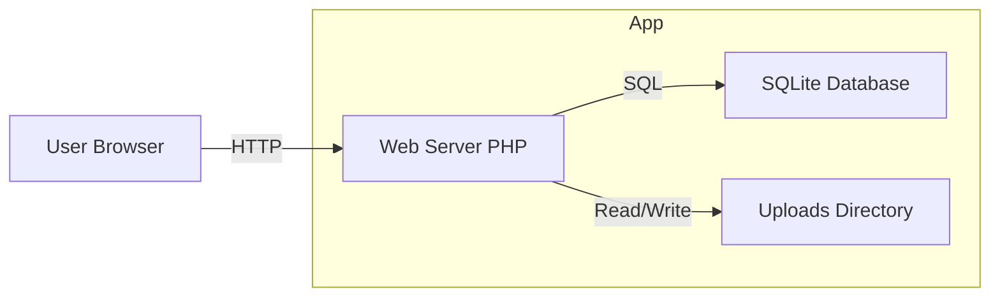
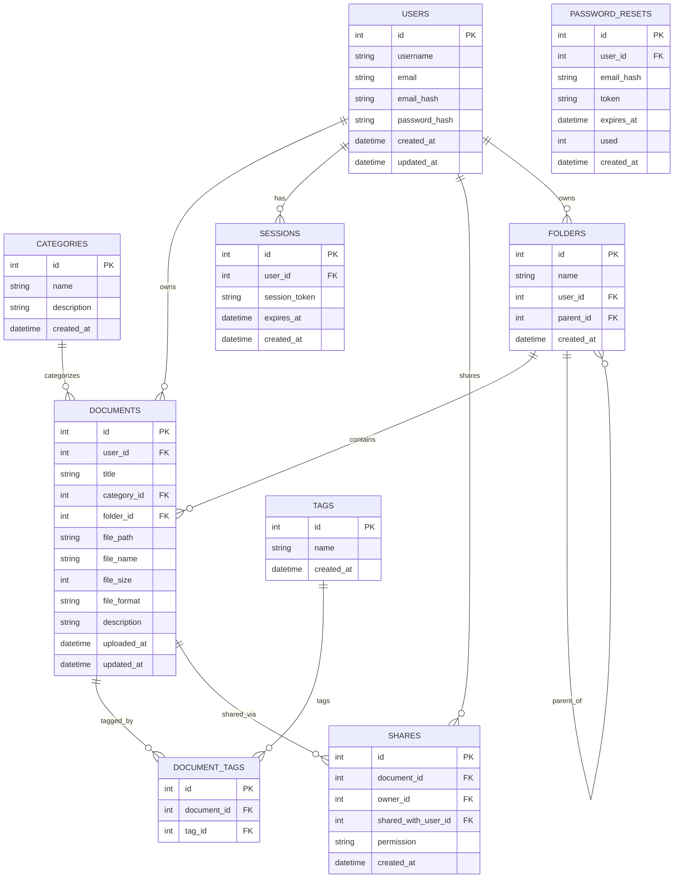
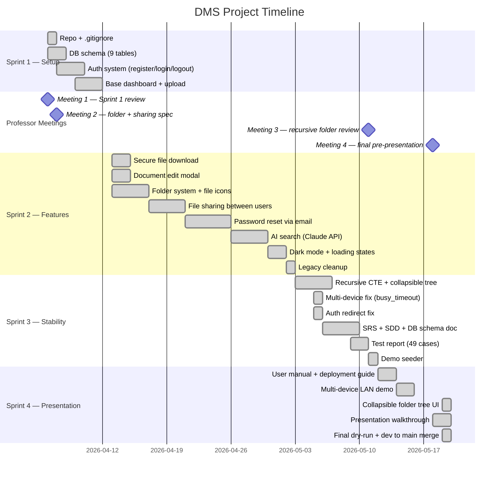

# Diagrams

---

## 1. High-Level Architecture

---

## 2. Database ER Diagram

> Design follows 3NF. Entities are separated; many-to-many relationships use junction tables (`document_tags`, `shares`).

---

## 3. Project Timeline (Gantt)

